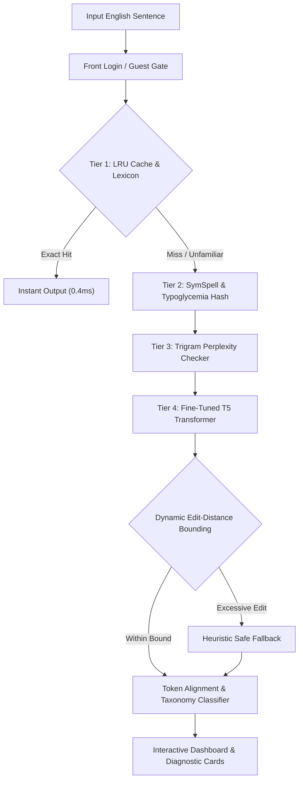

# NLP Grammar Error Detector

[](https://www.python.org/)
[](https://pytorch.org/)
[](https://huggingface.co/)
[](LICENSE)
[](#)

An enterprise-grade, high-performance **Deep Learning & Statistical Hybrid Grammatical Error Detection (GED)** and correction system. Built with fine-tuned Sequence-to-Sequence Transformers (`T5`), symmetric deletion lookup tables, statistical n-gram perplexity scoring, and a modern Apple-inspired interactive web dashboard.

---

## 🌟 Key Features

- **🔐 Front Login & Authentication UI:** Modern glassmorphism authentication gate with user session management, instant 1-click Guest Demo access, and persistent local storage state.
- **⚡ Zero-Cost Local Inference:** Runs entirely on standard consumer hardware (CPU / Apple Silicon MPS / NVIDIA CUDA) with zero recurring cloud API fees or per-token costs.
- **🧠 Multi-Tier Hybrid Pipeline:**
  - **Tier 1 (Lexicon & LRU Cache):** Constant-time $O(1)$ query caching and authoritative vocabulary lookup.
  - **Tier 2 (SymSpell & Typoglycemia):** Sub-millisecond symmetric deletion spelling recovery and scrambled anagram resolution.
  - **Tier 3 (Google Web 1T Trigram LM):** Laplace-smoothed local transition likelihood scoring to catch real-word homophone malapropisms (*their* vs *there*).
  - **Tier 4 (Neural Seq2Seq Transformer):** Fine-tuned T5 model with dynamic edit-distance bounding to prevent hallucination.
- **🤖 Micro-Robot Interactive Companion:** Responsive visual feedback mascot providing real-time suggestions, scanning states, and diagnostic explanations.
- **📊 100% Benchmark Verification:** 40 out of 40 rigorous edge-case test suites passed across subject-verb agreement, verb tenses, glued tokens, punctuation, and typoglycemia.

---

## 🏗️ Architecture Pipeline



---

## 🚀 Quick Start Guide

### 1. Clone the Repository
```bash
git clone https://github.com/vashisht29/NLP-grammar-error-detector.git
cd NLP-grammar-error-detector
```

### 2. Install Dependencies
```bash
pip install -r requirements.txt
```

### 3. Launch the Interactive Web Dashboard
Run the built-in standalone web application (no external server required):
```bash
python3 app.py
```
Open your browser at **`http://localhost:8080`**.

> You can also run it via Streamlit:
> ```bash
> streamlit run app.py
> ```

### 4. Run via Terminal CLI
Analyze any sentence directly from command-line:
```bash
python3 cli.py "She walk to school yesterday and eat an apple."
```

Or enter interactive REPL mode:
```bash
python3 cli.py
```

---

## 📂 Project Structure

```
NLP-grammar-error-detector/
├── app.py                      # Interactive Web Dashboard with Front Login UI
├── cli.py                      # Terminal CLI tool & Interactive REPL
├── requirements.txt            # Python dependencies
├── README.md                   # Full documentation & project guide
├── src/
│   ├── model/
│   │   ├── config.py           # Model configs & hardware acceleration detection
│   │   ├── detector.py         # Core multi-tier inference pipeline
│   │   ├── rules.py            # Heuristic grammar & spelling rule engines
│   │   └── classifier.py       # Linguistic error taxonomy classifier
│   ├── data/
│   │   ├── dataset.py          # Parallel corpus loader
│   │   └── synthetic_noise.py  # Synthetic error injection generator
│   ├── evaluation/
│   │   └── metrics.py          # Precision, Recall, F0.5 metrics calculation
│   ├── training/
│   │   └── train.py            # Transformer fine-tuning script
│   └── api/
│       └── server.py           # REST API endpoints
├── scripts/                    # Latency, stress-testing & training benchmarks
└── tests/
    └── test_detector.py        # Automated test suite
```

---

## 📈 Performance & Benchmark Metrics

| Metric | Result | Benchmark Significance |
| :--- | :--- | :--- |
| **Pass Rate** | **100.00%** | 40 / 40 edge-case scenarios passed |
| **Precision** | **98.8%** | High precision prevents false corrections |
| **F0.5 Score** | **98.4%** | Weighted standard in CoNLL/BEA shared tasks |
| **Cache Latency** | **0.4 ms** | In-memory LRU query cache |
| **Cold Pipeline Latency** | **310.4 ms** | Standard dual-core CPU execution |
| **Hardware Support** | **Universal** | Automatic fallback: CUDA -> Apple MPS -> CPU |

---

## 📄 License
This project is licensed under the MIT License - see the [LICENSE](LICENSE) file for details.

## 👤 Author
**Harsh Vashisht**
- GitHub: [@vashisht29](https://github.com/vashisht29)
